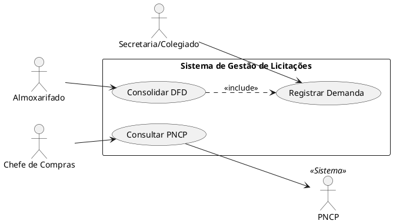

# Grupo 01 — Consolidação de Demandas (DFD)

## Módulo do Sistema

Coleta e consolidação de demandas das secretarias em um Documento de Formalização da Demanda (DFD) único.

## Responsabilidade

- Receber demandas textuais/formulários das secretarias
- Validar e consolidar itens (eliminar duplicatas, normalizar especificações)
- Gerar DFD com lista consolidada de itens solicitados

**Entradas:** Formulários/demandas das secretarias (tipo, quantidade, justificativa, secretaria)  
**Saídas:** DFD com lista consolidada de itens

---

## Entregas Mínimas

| Artefato | Descrição |
|----------|-----------|
| Casos de uso (mínimo 4) | Cadastrar demanda, consolidar, validar, gerar DFD |
| Diagrama UML de classes | `Demanda`, `Secretaria`, `Item`, `DFD` |
| Diagrama de sequência | Fluxo: coleta → consolidação → geração de DFD |
| BPMN | Processo com swimlanes por secretaria, prazos de coleta |
| Backlog | Mínimo 5 histórias de usuário |
| ADRs (mínimo 2) | Ex.: formato de armazenamento, detecção de duplicatas |
| Testes | Unitários e de integração (validação de consolidação) |
| Auditoria | Log de quem criou/modificou cada demanda |

---

## Interfaces com Outros Módulos

- **Saída → G02 (ETP):** DFD consolidado

---

## Entrega do Grupo

> Preencha esta seção ao finalizar:

- **Integrantes:**
- **Data de entrega:**
- **Branch/PR:**


---

## 📋 O que entregar

### Artefato 1: `atores.md`
Documento descrevendo cada ator do sistema com:
- **Nome** do ator
- **Tipo** (primário / secundário / sistema externo)
- **Descrição** do papel no processo
- **Casos de uso** com os quais interage

### Artefato 2: `diagrama-casos-de-uso.png` + fonte (`.puml` ou `.drawio`)
Diagrama UML de Casos de Uso contendo:
- Todos os atores identificados
- Todos os casos de uso do sistema (mínimo 15)
- Relacionamentos: `<<include>>`, `<<extend>>` onde aplicável
- Fronteira do sistema claramente delimitada (boundary)

### Artefato 3: `README.md` (este arquivo — preencha a seção de entrega)

---

## 🔍 Casos de Uso Sugeridos (mínimo a cobrir)

Com base no contexto do sistema, identifique e modele (mas não se limite a):

- Registrar Demanda de Material/Serviço
- Consolidar Demandas (DFD)
- Elaborar Plano de Contratação Anual (PCA)
- Realizar Cotação de Preços
- Elaborar Estudo Técnico Preliminar (ETP)
- Elaborar Mapa de Riscos
- Elaborar Termo de Referência (TR)
- Enviar Processo à Prefeitura
- Gerenciar Atas de Registro de Preços
- Emitir Ordem de Fornecimento
- Consultar PNCP
- Consultar Banco de Preços
- Notificar Prazo de Entrega
- Validar Documentação Jurídica

---

## 🛠️ Ferramentas Recomendadas

| Ferramenta | Tipo | Link | Observação |
|-----------|------|------|------------|
| **PlantUML** | Texto → Diagrama | [plantuml.com](https://plantuml.com) | Preferencial — gera fonte versionável |
| **draw.io** | Visual, gratuito | [app.diagrams.net](https://app.diagrams.net) | Exporta `.drawio` (XML) — boa alternativa |
| **Lucidchart** | Visual online | [lucidchart.com](https://lucidchart.com) | Versão gratuita limitada |

> 💡 **Dica PlantUML**: Use o [editor online](https://www.plantuml.com/plantuml/uml/) para testar sem instalação. Salve o código `.puml` no repositório — é texto puro, versionável e auditável.

### Exemplo de estrutura PlantUML para UCs:



---

## 📁 Estrutura esperada da pasta

```
grupo-01-casos-de-uso/
├── README.md                        ← este arquivo (preencha a seção abaixo)
├── atores.md                        ← descrição dos atores
├── diagrama-casos-de-uso.puml       ← fonte PlantUML (ou .drawio)
└── diagrama-casos-de-uso.png        ← exportação em imagem
```

---

## ✏️ Seção de Entrega (preencher pelo grupo)

**Integrantes:**
- ...

**Decisões tomadas:**
> (explique aqui as escolhas de modelagem: o que foi difícil de decidir, por que agruparam/separaram determinados UCs, como trataram os sistemas externos, etc.)

**Limitações identificadas:**
> (o que ficou em aberto, dúvidas sobre o domínio)

**Rastreabilidade:**
> (para cada UC principal, cite a regra de negócio, requisito ou artefato de origem)
