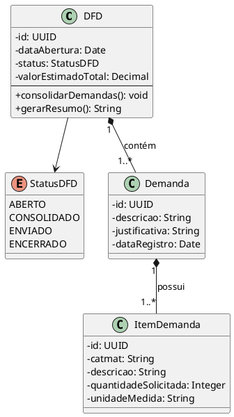

# Grupo 03 — Pesquisa e Gestão de Atas SRP

## Módulo do Sistema

Verificação de atas de SRP (Sistema de Registro de Preço) vigentes que podem ser reutilizadas (adesão/carona) em vez de abrir novo processo licitatório.

## Responsabilidade

- Receber ETP (G02)
- Pesquisar atas de SRP vigentes que cobrem os itens solicitados
- Comparar competitividade: preço da ata vs. cotação nova
- Calcular viabilidade de adesão (limite de 50% do quantitativo da ata)
- Gerar recomendação: adesão a ata existente ou novo processo

**Entradas:** ETP (G02)  
**Saídas:** Relatório de atas com recomendação de ação

---

## Entregas Mínimas

| Artefato | Descrição |
|----------|-----------|
| Casos de uso (mínimo 4) | Pesquisar ata, validar competitividade, calcular limite de adesão, gerar relatório |
| Diagrama UML de classes | `Ata`, `ProcessoLicitatorio`, `Adesao`, `Fornecedor`, `AnalisePrecoConcorrencia` |
| Diagrama de sequência | Busca em base de atas, validação de elegibilidade |
| BPMN | Fluxo: pesquisa → validação → decisão (adesão vs. novo processo) |
| Backlog | Mínimo 5 histórias de usuário |
| ADRs (mínimo 2) | Ex.: onde armazenar dados de atas? Local vs. Portal da Prefeitura? |
| Testes | Cálculo correto de 50%, validação de vigência |
| Auditoria | Quais atas foram consultadas, qual foi a decisão final |

---

## Interfaces com Outros Módulos

- **Entrada ← G02 (ETP):** ETP
- **Saída → G04 (TR):** Decisão de ata (adesão ou novo processo)

---

## Entrega do Grupo

> Preencha esta seção ao finalizar:

- **Integrantes:**
- **Data de entrega:**
- **Branch/PR:**

---

## 📋 O que entregar

### Artefato 1: `diagrama-classes-dominio.png` + fonte (`.puml` ou `.drawio`)
Diagrama UML de Classes com:
- Mínimo de 12 classes de domínio
- Atributos com tipos de dados
- Relacionamentos completos (associação, composição, agregação, herança)
- Multiplicidades corretas
- Sem classes de infraestrutura (sem `Repository`, `Service`, `Controller`)

### Artefato 2: `dicionario-de-dados.md`
Para cada classe, descreva:
- Responsabilidade da classe
- Atributos (nome, tipo, restrição, exemplo)
- Invariantes relevantes

---

## 🗂️ Classes-Chave para Modelar

Baseadas no contexto do sistema:

| Classe | Descrição |
|--------|-----------|
| `PCA` | Plano de Contratação Anual |
| `Demanda` | Necessidade registrada por uma secretaria |
| `DFD` | Documento de Formalização da Demanda |
| `ItemDemanda` | Item específico dentro de uma demanda |
| `ETP` | Estudo Técnico Preliminar |
| `MapaDeRisco` | Riscos identificados para a contratação |
| `Cotacao` | Pesquisa de preços com fornecedores |
| `ItemCotacao` | Preço de um item junto a um fornecedor |
| `TermoDeReferencia` | Especificação técnica completa |
| `ProcessoLicitatorio` | Registro do processo enviado à Prefeitura |
| `AtaRegistroPrecos` | Ata SRP vigente com itens e preços |
| `OrdemFornecimento` | Pedido emitido à empresa vencedora |
| `Secretaria` | Unidade demandante (colegiado, setor) |
| `Fornecedor` | Empresa participante |

> ⚠️ Cuidado com as **regras de negócio** ao definir multiplicidades:
> - Uma `DFD` pode ter N `Demandas` de N `Secretarias`
> - Uma `AtaRegistroPrecos` pode gerar 0..N `OrdemFornecimento`
> - Um `ProcessoLicitatorio` tem exatamente 1 `TermoDeReferencia`

---

## 🛠️ Ferramentas Recomendadas

| Ferramenta | Link | Observação |
|-----------|------|------------|
| **PlantUML** | [plantuml.com](https://plantuml.com) | Preferencial — código versionável |
| **draw.io** | [app.diagrams.net](https://app.diagrams.net) | Boa UX, exporta XML |
| **StarUML** | [staruml.io](https://staruml.io) | Desktop, rico em recursos UML |
| **Mermaid** | [mermaid.live](https://mermaid.live) | Integra bem com GitHub MD |

### Exemplo PlantUML — Classe básica:



---

## 📁 Estrutura esperada da pasta

```
grupo-03-diagrama-classes/
├── README.md
├── diagrama-classes-dominio.puml    ← fonte PlantUML (ou .drawio)
├── diagrama-classes-dominio.png     ← exportação
└── dicionario-de-dados.md           ← descrição detalhada das classes
```

---

## ✏️ Seção de Entrega (preencher pelo grupo)

**Integrantes:**
- ...

**Decisões tomadas:**
> ...

**Limitações identificadas:**
> ...
